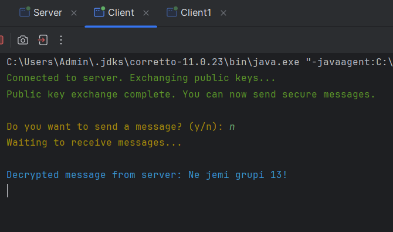
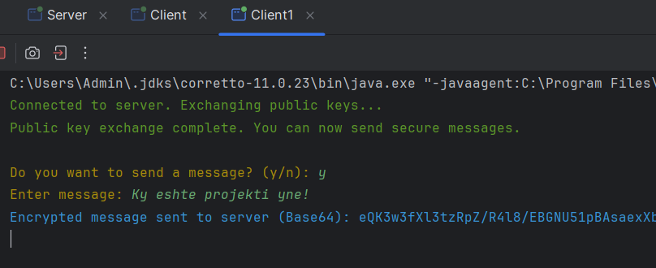
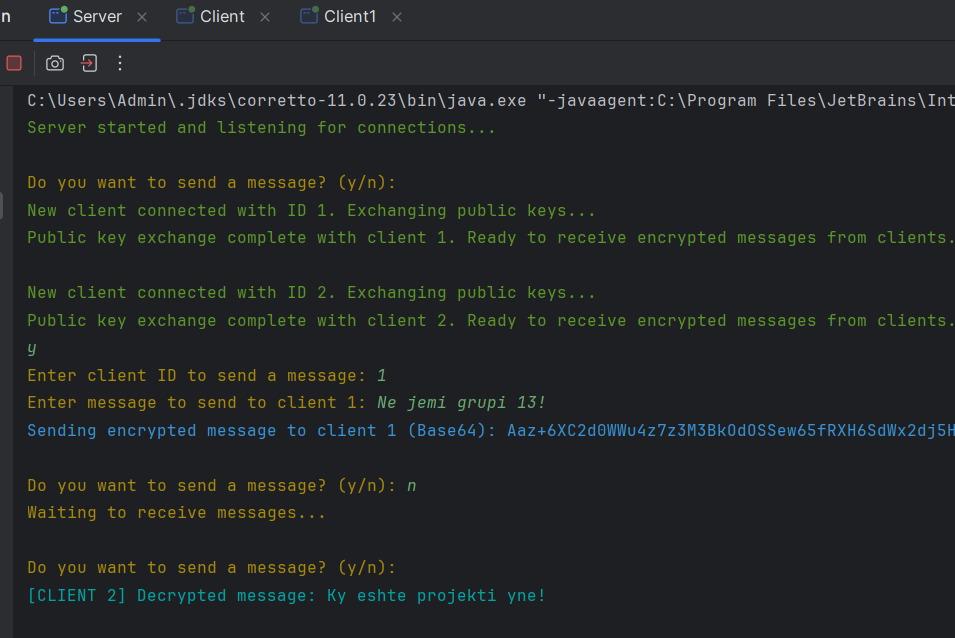

# Grupi-13_Detyra-3

## Çfarë është RSA

- RSA (ose ndryshe njohur Rivest-Shamir-Adelman) është një prej sistemeve të para të enkriptimit që kanë përdorur çelës publik. Cipheri bazohet në parimet matematike të faktorizimit të numrave të mëdhenj prim.
- RSA funksionon duke përdorur dy çelësa të ndryshëm: një çelës publik për enkriptim dhe një çelës privat për dekriptim.

Ky projekt demonstron përdorimin e RSA-së për enkriptimin dhe dekriptimin e të dhënave në një aplikacion klient-server. Projekti përkrah më shumë se vetëm një klient. Projekti përfshin dy komponentë kryesorë:

- **Serveri**: Gjeneron çiftin e çelësave (publik dhe privat) dhe dërgon çelësin publik te klienti. Serveri gjithashtu dekripton mesazhet e enkriptuara që pranon nga klienti duke përdorur çelësin privat. Dhe enkripton mesazhet dërguar klientëve me çelësin e tyre publik.
- **Klienti**: Merr çelësin publik nga serveri dhe e përdor atë për të enkriptuar mesazhet që dërgon te serveri. Klienti mund të dërgojë mesazhe të enkriptuara të cilat serveri do t'i dekriptojë. Po ashtu klienti dekripton mesazhet e dërguara nga serveri me celësin privat të tij.

## Përshkrimi i kodit

Gjuha e përdorur ka qenë Java. Projekti eshte zhvilluar ne 3 files: për algoritmin RSA, për klientin (ka dy files, në mënyrë që të simulojmë shumë klientë) dhe për serverin.

### RSA

Kjo klasë është përgjegjëse për implementimin e operacioneve bazë të algoritmit RSA. Konkretisht, klasa ofron funksionalitete për:

- Gjenerimin e çelësave
- Enkriptim dhe dekriptim
- Menaxhimin e çelësave

Kjo klasë përmban një instancë të “KeyPair” e cila përmban një çift çelësash (publik dhe privat). Konstruktori i kësaj klase inicializon një “KeyPairGenerator” për algoritmin e RSA dhe vendos madhësinë e çelësit në 2048 bit. Përpos kësaj, gjeneron një çift çelësash që përbëhet nga një çelës publik dhe një çelës privat, që kjo do të bëhet për klientin dhe serverin në file-et e tjerë.

- Metodat getPublicKey dhe getPrivateKey janë thjeshtë për të kthyer çelësin publik dhe privat përkatësisht, pra getters.
- Metoda encrypt krijon një objekt Cipher për enkriptim duke përdorur RSA me modalitetin ECB dhe padding PKCS1. Inicializon Cipher në modalitetin e enkriptimit duke përdorur çelësin publik. Enkripton të dhënat dhe kthen të dhënat e enkriptuara.
- Metoda decrypt dekripton të dhënat të cilat janë të enkriptuara me çelësin privat të dhënë duke përdorur algoritmin RSA me padding PKCS1.
- Metoda toBase64 dhe fromBase64 shërbejnë për të enkoduar dhe dekoduar në formatin Base64.

### Serveri

Klasa **Server** është përgjegjëse për menaxhimin e lidhjeve të shumta të klientëve, duke trajtuar komunikimin midis klientëve dhe serverit në mënyrë të sigurt duke përdorur enkriptimin RSA. Ajo përdor threads të shumëfishta për të komunikuar me klientët njëkohësisht dhe ofron funksionalitet për dërgimin dhe marrjen e mesazheve të enkriptuara. Brenda saj janë të definuara disa funksione:

- Metoda main: E nis serverin dhe menaxhon lidhjet hyrëse të klientëve. E hap një ServerSocket në portin 12345 dhe pret për connections që vijnë. Pastaj nis një thread në background e cila e handle inputin e userit për të dërguar mesazhe tek klientët specifikë. Poashtu, pranon connections që vijnë përmes një while loop dhe në fund krijon një thread të ri (ClientHandler) për çdo klient të lidhur për të menaxhuar komunikimin.
- Metoda sendMessageToClient: Enkripton dhe dërgon një mesazh tek një klient specifik. Kjo metodë përdor një instancë të RSA për të enkriptuar mesazhin duke përdorur çelësin publik të klientit. Merr socket-in e klientit, konverton mesazhin e enkriptuar në Base64, dhe dërgon mesazhin e enkriptuar me socket.
- Klasa ClientHandler(): Merret me komunikimin me një klient. Dërgon çelësin publik të serverit tek klienti pas konektimit. Merr dhe ruan çelësin publik të klientit. Pret mesazhe të enkriptuara nga klienti, i dekripton ato dhe i shfaq në console. Pastron resurset pasi klienti diskonektohet.

Vlen të përmendet se Serveri ruan çelësat publik të klientëve, të shoqëruar me nga një ID, përmes nje map-i.

### Klienti

- Metoda main(): E inicializon klientin, e konekton atë në server, e mundëson shkëmbimin e çelësave publik, dhe dërgimin dhe marrjen e mesazheve të enkriptuara. Ajo fillon duke vendosur një lidhje me serverin në "localhost" në portin 12345 duke përdorur një Socket. Pastaj krijon objektet ObjectOutputStream dhe ObjectInputStream për të dërguar dhe marrë të dhëna, përkatësisht, dhe përdor një Scanner për të lexuar inputet e përdoruesit nga tastiera. Një instancë e klasës RSA krijohet, që i gjeneron një çift të ri çelësash RSA (çelës publik dhe privat). Klienti merr çelësin publik të serverit dhe dërgon çelësin e vet publik te serveri, duke mundësuar komunikim të sigurt. Krijohet një thread i ri, i cili pret për mesazhe të enkriptuara nga serveri, të cilat dekriptohen përmes çelësit privat të klientit, dhe shfaqen në console. Threadi kryesor futet në një loop, ku e pyet përdoruesin nëse dëshiron të dërgojë një mesazh. Nëse përdoruesi zgjedh të dërgojë një mesazh, ai lexon mesazhin nga tastiera, e enkripton atë duke përdorur çelësin publik të serverit dhe e dërgon mesazhin e enkriptuar te serveri. 

## Shembull ekzekutimi

Në këtë projekt mund të kemi shumë shembuj ekzekutimi, varësisht se sa klientë kyçen, po ashtu në çdo connection kush është duke dërguar dhe kush duke pranuar.
Gjithesi shembulli më i mirë për të parë funksionalitetin e projektit është nëse kemi dy klientë të kyçur në server, ku njëri pranon dhe tjetri dërgon.

- Console e Klientit 1:
  

- Console e Klientit 2:
  

- Console e Serverit:
  
